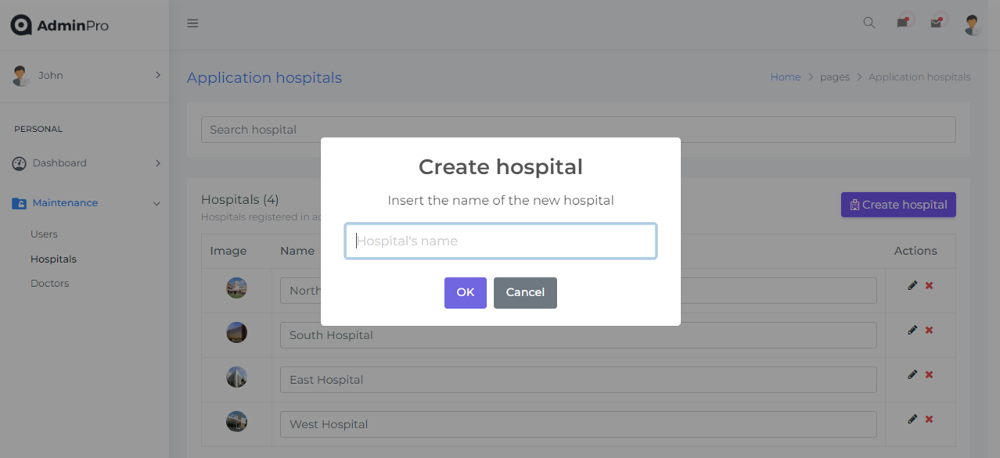

# AdminPro

Administrative platform designed to manage doctors, hospitals and users.
This project was generated with _Angular CLI_ version 16.2.3.

## Tech Stack

- MEAN Stack: Mongo - Express - Angular - Node
- Form validation.
- AdminGuard.
- LazyLoad.
- Styles with CSS.
- Other tools: ng2-charts, SweetAlert2.

## Functionalities

- Login with email and password or Google SignIn.
- Sign Up form.
- Graphics displayed with ng2-charts.
- CRUD of Users, Hospitals and Doctors.
- Users, Hospitals and Doctors maintenance:
  - Input search.
  - Table with total items and pagination.
  - Edit or remove items.
  - Change user's image.

## Deployment

The project was deployed using Netlify.
[Adminpro](https://preeminent-tulumba-a5a972.netlify.app/)

## Usage

**IMPORTANT:** The project was developed using **npm 9.5.1 version**. Please, check your npm version to avoid problems.

To run the project locally follow the next steps:

1. Clone the project: `git clone https://github.com/JulianaCotabarren/adminpro`

2. Go to the project directory: `cd adminpro`

3. Install dependencies: `npm install`

4. Run the app in the development mode: `ng serve`

5. Open your localhost in the indicated port to view it in the browser.

6. Login with _email: johndoe1@email.com_ and _password: 12345678_

## Website Images

